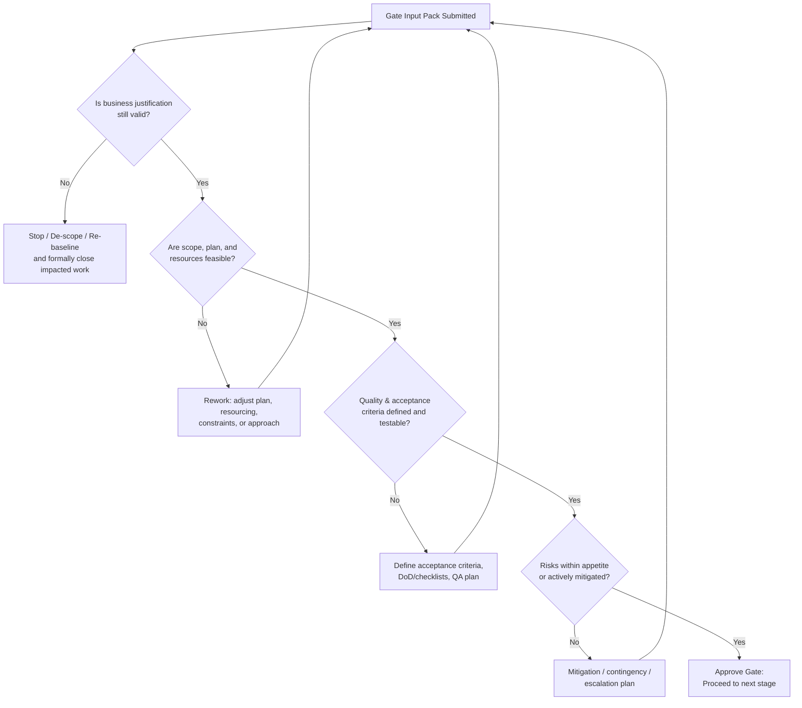

# End-to-end project execution playbook based on a standard project management document

## Executive summary

This report turns a “standard” project management (PM) document—one that typically contains processes, templates, roles, and deliverables—into an implementable execution system. It is grounded in internationally recognized PM standards and official sources, especially the principles-based approach and performance domains from entity["organization","Project Management Institute","project mgmt org, us"] and the entity["book","A Guide to the Project Management Body of Knowledge (PMBOK Guide)","7th ed 2021"] ecosystem (principles, performance domains, and explainers).citeturn6view0turn7view0turn11view0turn11view1

A core implication of modern guidance is that you should not “run the book”; you should tailor a delivery system to the project context. PMI’s tailoring guidance is explicit: select an initial development approach (predictive, adaptive, or hybrid), tailor for organizational requirements (e.g., governance, key reviews, QA, policy compliance), tailor for the project’s size/criticality, then “inspect and adapt” through ongoing improvement.citeturn11view0turn7view0turn6view0

Because your provided PM document’s specifics are unknown here, anything that depends on project particulars—scope boundaries, budget, team size, delivery cadence, procurement constraints, compliance requirements, release strategy—must be treated as unspecified. This report flags those items and provides practical options for small/medium/large projects, while still giving a rigorous, end-to-end method that a project manager can execute immediately. PMI’s performance-domain framing supports this: a “project performance domain” is a group of related activities critical for effective delivery of project outcomes, and domains should be used (and tailored) together as an integrated management system.citeturn6view0turn7view0

Finally, this report emphasizes governance, visibility, and disciplined control of “the escalation trio” (risks, issues, and changes) using lightweight but formal logs and decision gates. PMI’s guidance distinguishes forms (for individual items) and logs (lists of items) and stresses evaluating changes by the value gained versus impacts to budget, schedule, risk, and quality—without letting logs become a substitute for the actual work plan (WBS/schedule).citeturn19view0turn13view0

## Inputs, assumptions, and tailoring approach

The execution approach should start with a structured “document-to-operating-model translation,” because PMI treats tailoring as continuous and context-driven, and because development approach and life cycle depend on what you are delivering and how you intend to deliver it.citeturn11view0turn6view0turn7view0

### Document-to-execution translation method

Use this method to convert your PM document into an actionable project delivery toolkit:

1) Extract and normalize “what the document says” into a single index:
- Required processes/workflows (e.g., planning, reporting, change control).citeturn13view0turn6view0  
- Required governance touchpoints (reviews, approvals, decision authorities).citeturn13view0turn11view0  
- Required artifacts/templates (charter, plans, registers/logs, reports).citeturn19view0turn6view0  
- Required roles and responsibilities (including who approves what).citeturn13view0turn7view0  

2) Select a development approach and life-cycle shape up front, then confirm it during planning:
- PMI explicitly names predictive/adaptive/hybrid as initial choices, and notes the project deliverables influence the development approach, delivery cadence, and life-cycle phases.citeturn11view0turn6view0  

3) Tailor for the organization, then the project:
- Tailoring for organization explicitly includes governance, key reviews, quality assurance, policy compliance, and PMO approval if applicable.citeturn11view0turn13view0  
- Tailoring for the project explicitly includes adding/removing/modifying aspects based on size and criticality.citeturn11view0turn13view0  

4) Bake ongoing improvement into the execution cadence:
- PMI emphasizes “inspect and adapt,” including retrospectives and lessons learned.citeturn11view0turn7view0  
- Scrum (as the dominant adaptive delivery framework) operationalizes inspection and adaptation via timeboxed events and transparency mechanisms.citeturn5view2turn9view1  

### Unspecified items and sizing options

If your PM document does not specify the following, treat them as open decisions that must be settled at Gate 1 (Initiation approval) or Gate 2 (Plan approval), because governance and planning rigor depend on them.citeturn13view0turn6view0turn11view0

| Topic often missing in PM docs | Why it matters to execution | Small project option | Medium project option | Large / high-criticality option |
|---|---|---|---|---|
| Scope boundaries and success outcomes | Delivery must drive outcomes/value; “value is the ultimate indicator of success” in PMI’s principles.citeturn7view0 | One-page scope + clear acceptance criteria | Scope statement + requirements model/backlog | Formal scope baseline + traceability + formal acceptance gates |
| Budget & funding model | Changes must be evaluated vs impacts to budget/schedule/risk/quality.citeturn19view0 | Team capacity-based funding | Phase funding with stage gates | Incremental funding with investment governance and benefits tracking |
| Team size & skill mix | Team domain focuses on people producing deliverables and outcomes.citeturn6view0turn7view0 | 3–7 core roles, part-time SMEs | 8–15 with dedicated PM/PO and QA | Multi-team program; dedicated governance, QA, security, operations |
| Delivery cadence | Approach & cadence influence life-cycle phases.citeturn6view0 | One release or 2–4 increments | Monthly releases or 2–3-week iterations | Multi-release roadmap; integrated release trains as needed |
| Governance/approval authority | Governance defines decision-making procedures and gates.citeturn13view0turn11view0 | Single sponsor approval | Sponsor + steering/PMO for key gates | Formal board + audit/assurance; escalation thresholds |
| Compliance & quality requirements | Quality must meet acceptance requirements; change fatigue risk must be managed.citeturn7view0turn23view0 | Lightweight QA & peer review | Test strategy + acceptance criteria | Regulated QA, audits, evidence-based reporting |

### Choosing predictive, adaptive, or hybrid

Use a pragmatic selection rule: choose the approach that best fits (a) how knowable requirements are, (b) how safely you can release in increments, and (c) how much governance is mandated by your organization. PMI explicitly frames development approach selection in these terms (deliverables → approach/cadence → phases).citeturn6view0turn11view0

| Approach | Best fit conditions | Typical planning style | Control style | Primary standard anchor |
|---|---|---|---|---|
| Predictive | Requirements stable; high cost of change late; release at end or in few controlled drops | Heavier up-front baseline, then controlled change | Gate-based governance + variance control | PMI tailoring + GAO scheduling/cost controlsciteturn11view0turn22view0turn21view0 |
| Adaptive (Scrum) | Complex work; need rapid feedback; incremental value delivery | Rolling-wave planning per Sprint | Transparency/inspection/adaptation; timeboxes | entity["book","The Scrum Guide","2020 official guide"]citeturn5view2turn9view2 |
| Hybrid | Mixed certainty (e.g., fixed compliance + evolving product); partial incremental releases | Baseline a “spine” + iterative detailing | Gates for governance + iterative delivery loops | PMI “predictive/adaptive/hybrid” tailoring modelciteturn11view0turn6view0 |

## Project lifecycle and decision gates

A robust end-to-end lifecycle should meet three conditions simultaneously:
- It is gate-driven enough to satisfy governance and ensure continued justification.citeturn13view0turn8view0  
- It is iterative enough to incorporate learning and adaptation (planning is ongoing; risk management is iterative).citeturn6view0turn11view0turn25view0  
- It is outcome/value-oriented (value and benefits, not just outputs).citeturn7view0turn6view0  

### Mapped project lifecycle: phases, objectives, inputs, outputs

The table below is designed to be directly “mapped” onto whatever phase names your PM document uses (e.g., Initiation/Planning/Execution/Close; or stage-based variants). PMI explicitly treats life-cycle phases as influenced by development approach and cadence; therefore, phases should be defined and then tailored.citeturn6view0turn11view0

| Phase | Objectives | Key inputs | Key outputs |
|---|---|---|---|
| Discover & Tailor | Convert PM document into execution rules; pick initial development approach; define governance backbone | PM document, organizational governance constraints, known business objectives | Tailored delivery approach, preliminary governance plan, initial artifact set (templates/logs)citeturn11view0turn13view0turn19view0 |
| Initiate | Confirm value and success outcomes; establish role clarity and decision authority; identify stakeholders | Project idea/mandate, sponsor intent, stakeholder landscape | Charter/brief, stakeholder map, initial risk/issue/change logging, Gate 1 approval decisionciteturn7view0turn6view0turn19view0 |
| Plan (baseline + rolling) | Organize/coordinate work; establish delivery plan and measurement method; align quality and acceptance | Charter, requirements/backlog, constraints, resource availability | Integrated plan (scope/schedule/cost or backlog/release plan), QA plan, comms plan, baselines where applicable, Gate 2 approvalciteturn6view0turn23view0turn13view0 |
| Execute & Deliver (iterative) | Produce deliverables that drive intended outcomes; manage project work & learning; keep stakeholders engaged | Approved plan/backlog, team capacity, environments/tools | Incremental deliverables, QA evidence, operational readiness artifacts, updated logs, periodic gate/stage reviewsciteturn6view0turn7view0turn11view1turn9view4 |
| Monitor, Control, Measure (continuous) | Maintain acceptable performance; respond to variances; manage uncertainty | Status data, QA results, risks/issues/changes | Status reports, forecasts, decisions, approved changes, corrective actionsciteturn6view0turn22view0turn21view0turn19view0 |
| Close & Transition | Formal acceptance; handover to operations; capture lessons learned; close contracts | Accepted deliverables, deployment/support documentation | Handover package, closure report, benefits follow-up plan where applicableciteturn11view1turn6view0turn11view0 |

### Decision-gate flowchart

The gate model below fits both predictive and hybrid projects and can be adapted to iterative delivery by placing it at stage boundaries (e.g., monthly releases, quarterly increments). Governance guidance emphasizes that governance must define decision gates, reporting, and control processes, and that governance is not one-size-fits-all.citeturn13view0turn11view0



### Milestones and gating criteria

Use the criteria below as a minimum “gate checklist.” It aligns with PMI’s focus on value outcomes, stakeholder engagement, quality/acceptance criteria, continuous risk evaluation, and governance-defined control points.citeturn7view0turn6view0turn13view0turn25view0

| Gate | Decision owner | Entry artifacts | Pass criteria (minimum) |
|---|---|---|---|
| Gate 0: Intake | Sponsor / governance delegate | Problem/opportunity statement | Clear objective and sponsor; initial alignment to strategy/valueciteturn7view0turn13view0 |
| Gate 1: Initiation approval | Sponsor + governance forum | Charter/brief; stakeholder map; initial risk log | Roles/authority defined; stakeholders identified; initial risks logged; approach selected (predictive/adaptive/hybrid)citeturn11view0turn6view0turn19view0 |
| Gate 2: Plan approval / baseline | Sponsor + PMO/steering (as needed) | Integrated plan (or release plan); QA approach; comms plan | Plan is feasible; measurement method defined; acceptance criteria defined; governance cadence setciteturn6view0turn23view0turn13view0 |
| Gate 3: Release readiness | Business owner + operations owner | Tested increment; operational docs; training/support guides | Meets acceptance criteria/DoD; operational handover package ready; risks/issues controlled or acceptedciteturn9view3turn11view1turn7view0turn19view0 |
| Gate 4: Closure | Sponsor + operations | Acceptance sign-off; lessons learned; closure report | Deliverables accepted; transition complete; closure artifacts stored; benefits tracking assigned if neededciteturn11view1turn11view0turn13view0 |

## Phase-by-phase execution playbook

This section is a practical execution “runbook.” It intentionally uses PMI’s eight performance domains as cross-cutting coverage areas (stakeholders, team, development approach & life cycle, planning, project work, delivery, measurement, uncertainty), because PMI defines these as critical activity groups for delivering outcomes.citeturn6view0

To keep this implementable, each phase includes: (a) activities, (b) a step-by-step checklist, and (c) the “minimum viable artifacts” that should exist by the end of the phase. Planning is explicitly treated as ongoing and adaptive in timing/frequency depending on approach and context.citeturn6view0turn11view0

### Discover & Tailor

Primary intent: convert your PM document into a tailored, “just enough” delivery system and toolset that maximizes value while managing cost and speed, consistent with PMI’s tailoring principle and tailoring process explainer.citeturn7view0turn11view0

Step-by-step checklist:
1) Identify mandated governance constraints (reviews, approvals, escalation thresholds).citeturn11view0turn13view0  
2) Select initial development approach: predictive, adaptive, or hybrid.citeturn11view0turn6view0  
3) Define project life-cycle phases and delivery cadence consistent with approach.citeturn6view0turn11view0  
4) Select templates/logs: risk, issue, change; define whether you need forms + logs or logs only.citeturn19view0turn11view0  
5) Define minimum reporting package and meeting cadence (status, steering, gate reviews).citeturn13view0turn6view0  
6) Define “ongoing improvement” mechanism (retro cadence, lessons learned capture).citeturn11view0turn6view0  

Minimum viable artifacts:
- Tailored governance plan (who approves what; gate schedule).citeturn13view0turn11view0  
- Artifact list and owners (templates for charter, plans, logs, reports).citeturn19view0turn6view0  

### Initiate

Primary intent: establish “definition of the endeavor,” stakeholder engagement strategy, and role clarity so that decision-making and accountability are unambiguous—explicit governance objectives in PMI guidance.citeturn13view0turn6view0

Step-by-step checklist:
1) Define intended outcomes and value: what changes, for whom, and how value will be recognized. PMI emphasizes continual alignment to objectives/benefits/value.citeturn7view0  
2) Identify stakeholders and decide engagement depth; PMI’s stakeholder principle requires proactive engagement “to the degree needed.”citeturn7view0turn6view0  
3) Assign roles and decision authority (sponsor, PM, product/business owner, tech lead, QA, operations). Governance guidance stresses defining accountability and responsibilities and mapping them to deliverables.citeturn13view0turn8view0  
4) Establish initial logs:
   - Start risk log (future uncertainties), issue log (present concerns), and change log (past decisions needing revision).citeturn19view0turn6view0  
5) Confirm initial scope boundaries and constraints (even if high-level). If unknown, explicitly mark as “TBD” and target resolution by Gate 2.citeturn13view0turn6view0  
6) Gate 1 review: approve to plan, pivot, or stop. Governance is an oversight function across the project life cycle and must be tailored.citeturn13view0  

Minimum viable artifacts:
- Charter or project brief (even lightweight).citeturn13view0turn7view0  
- Stakeholder map + engagement plan skeleton.citeturn6view0turn7view0  
- Initial risk/issue/change logs.citeturn19view0turn6view0  

### Plan

Primary intent: organize, elaborate, and coordinate work throughout the project. PMI explicitly states planning occurs up front and throughout, with amount/timing varying by development approach, environment, and stakeholders.citeturn6view0

Step-by-step checklist:
1) Define scope model:
- Predictive: scope statement + WBS + acceptance criteria.citeturn6view0turn19view0  
- Adaptive: ordered backlog and clear Product Goal / Sprint Goals (as applicable).citeturn9view0turn9view4  

2) Build schedule/release plan:
- Predictive/hybrid: develop an integrated schedule where the critical path is identified and validated; GAO emphasizes that a valid critical path is necessary to analyze effects of slippage and determines earliest completion date.citeturn22view0  
- Adaptive: define Sprint cadence and forecast using empiricism; Scrum notes burn-down/burn-up can be useful but do not replace empiricism.citeturn9view0turn5view2  

3) Resource plan and capacity:
- Identify bottlenecks and constraints; schedule/resource realism is a key schedule-quality factor (GAO ties reliable critical path to capturing all activities and resource assignment).citeturn22view0  

4) Cost and effort estimation approach (if applicable):
- For higher rigor, GAO frames reliable cost estimates as comprehensive, well-documented, accurate, and credible, and emphasizes risk/uncertainty analysis and iterative updating.citeturn21view0  

5) Quality plan:
- Define acceptance criteria and quality measures; PMI’s quality principle requires deliverables meet acceptance requirements and that processes are effective.citeturn7view0  
- If Scrum-based delivery is used, define and enforce Definition of Done as a formal quality state that creates transparency.citeturn9view3  

6) Communication plan:
- Define what is communicated, to whom, how often, and by whom; governance guidance explicitly calls for balanced meetings/reporting and decision gates.citeturn13view0turn6view0  

7) Risk plan:
- Define risk criteria, response strategies, and escalation; PMI notes risks include opportunities and threats and should be addressed continually.citeturn7view0turn6view0  

8) Gate 2 approval: confirm plan feasibility, acceptance criteria, measurement method, and governance cadence.citeturn13view0turn6view0  

Minimum viable artifacts:
- Integrated baseline plan (predictive/hybrid) or release/Sprint plan and backlog rules (adaptive).citeturn6view0turn9view2  
- QA plan and acceptance criteria / DoD.citeturn7view0turn9view3  
- Comms plan and meeting cadence.citeturn13view0  

### Execute & Deliver with continuous monitoring/control

Primary intent: establish project processes, manage resources, keep learning, and deliver scope and quality that drive intended outcomes—exactly the focus of PMI’s Project Work and Delivery domains.citeturn6view0

Step-by-step checklist:
1) Run delivery in increments consistent with the chosen cadence:
- PMI notes delivery may release throughout the life cycle, at specific points, or at end; business value may be realized long after the project ends.citeturn6view0  
- Scrum executes delivery within Sprints; Sprint Planning creates the plan, and the Product Owner is accountable for maximizing value; Developers are accountable for quality via Definition of Done.citeturn9view0turn9view3  

2) Operationalize stakeholder engagement:
- PMI ties productive stakeholder involvement to decision-making and implementation and links stakeholder engagement to value delivery.citeturn6view0turn7view0  

3) Maintain logs without “log drowning”:
- Use forms for individual items and logs for lists; keep tasks in the WBS/schedule rather than in risk/issue/change logs.citeturn19view0  

4) Measurement and corrective action loop:
- PMI defines measurement as assessing performance and taking actions to maintain acceptable performance; timely/accurate information enables learning and action on variances.citeturn6view0  

5) Stage/release readiness:
- Provide operations with deployment/testing/training/user documentation as part of transition; PMI’s value delivery system example shows project teams releasing deployment and user-manual materials to operations to enable support.citeturn11view1  

Minimum viable artifacts (by each increment/release):
- Tested increment and acceptance evidence.citeturn7view0turn9view3  
- Updated status, risks/issues/changes, and decision records.citeturn6view0turn19view0  
- Operational readiness package for releases moving into production/operations.citeturn11view1  

### Close & Transition

Primary intent: acceptance, transition, and institutional learning, consistent with the “ongoing improvement” expectation and with value delivery concepts emphasizing sustainment and feedback loops.citeturn11view0turn11view1

Step-by-step checklist:
1) Confirm acceptance against predefined acceptance criteria / DoD; quality is explicitly tied to acceptance criteria in PMI and Scrum.citeturn7view0turn9view3  
2) Complete handover to operations (documentation, training, support model, known issues).citeturn11view1  
3) Close procurement/contracts (if applicable) and archive project artifacts to the governance repository.citeturn13view0  
4) Conduct a closure retrospective / lessons learned; PMI’s tailoring process includes lessons learned as ongoing improvement input.citeturn11view0  
5) Assign benefits/outcomes tracking owner if value is realized post-project; PMI notes value can be realized after project completion.citeturn7view0turn6view0  

## Governance, roles, and deliverables

Governance is the mechanism by which decision rights, oversight, metrics, gates, and controls are defined and operated. PMI’s governance guidance stresses governance must be tailored and should include meetings, reporting, risk/issue management, assurance, and control processes throughout the project life cycle.citeturn13view0

### Standard roles set

Your PM document likely defines many of these roles; if it does not, the set below is a practical minimum that supports clear accountability (a governance requirement).citeturn13view0turn7view0

- Sponsor / Executive (funding, strategic alignment, gate approvals).citeturn13view0  
- Project Manager (integrates planning, execution, reporting, and controls).citeturn13view0turn6view0  
- Product/Business Owner (value definition, prioritization decisions, acceptance). Scrum calls out Product Owner accountability for maximizing value and backlog management in adaptive delivery.citeturn9view0turn7view0  
- Delivery Team / Developers (build, test, deliver; Scrum assigns Developers accountability for quality via DoD).citeturn9view0turn6view0  
- Technical Lead / Architect (technical direction, integration, nonfunctional requirements).citeturn13view0  
- QA/Test Lead (quality plan execution, acceptance evidence).citeturn7view0turn23view0  
- Operations / Service Owner (deployment, support readiness; feedback loop).citeturn11view1  
- PMO / Governance body (method compliance, assurance, repository).citeturn13view0turn11view0  

### RACI matrix (core governance decisions and outputs)

The matrix below is a reusable default. Tailor it to match what your PM document states about authority and approvals, since governance must align to organizational governance and be “right-sized.”citeturn13view0turn11view0

Roles:  
- SP = Sponsor/Executive  
- PM = Project Manager  
- BO = Business Owner / Product Owner  
- TL = Technical Lead  
- QA = QA/Test Lead  
- OP = Operations/Service Owner  
- GV = Governance/PMO  

| Work product / decision | SP | PM | BO | TL | QA | OP | GV |
|---|---|---|---|---|---|---|---|
| Gate 0 intake approval | A | R | C | C | I | I | C |
| Charter / brief | A | R | C | C | I | I | C |
| Development approach selection | A | R | C | C | I | I | C |
| Plan baseline (or release plan approval) | A | R | C | C | C | C | C |
| Acceptance criteria / DoD approval | A | C | R | C | R | C | I |
| Change approval (major) | A | R | C | C | C | C | C |
| Release readiness / go-live | A | R | C | C | C | R | C |
| Closure sign-off | A | R | C | I | C | C | C |

### Key deliverables and templates checklist

The deliverables list below is a practical superset (predictive + adaptive + hybrid). Your PM document might already provide templates—if it does, use them; if it does not, create the minimal versions shown here. PMI emphasizes that logs and forms are powerful enablers if kept simple and correctly used.citeturn19view0turn11view0turn6view0

| Deliverable / template | Purpose | Minimum fields / contents | Typical owner |
|---|---|---|---|
| Charter / Project Brief | Authorizes the work; clarifies objectives and authority | Outcomes/value, scope boundaries, constraints, roles, initial risks | PM (R), Sponsor (A)citeturn13view0turn7view0 |
| Stakeholder map + engagement plan | Ensures right involvement in decisions | Stakeholder, interest, influence, engagement strategy, cadence | PM / BOciteturn6view0turn7view0 |
| Integrated plan or Release plan | Coordinates work and cadence | Milestones/Sprints, dependencies, resourcing, key dates | PMciteturn6view0turn22view0turn9view2 |
| Acceptance criteria & QA plan | “Testable” definition of done/accept | Acceptance criteria, test strategy, evidence | QA (R), BO (A)citeturn7view0turn9view3turn23view0 |
| Risk register | Tracks threats/opportunities | ID, description, likelihood/impact, owner, response, status | PM (R) with team inputciteturn7view0turn25view0turn19view0 |
| Issue log | Tracks active problems | ID, description, owner, due date, escalation path | PMciteturn19view0turn13view0 |
| Change log + change request form | Controls changes to baseline/backlog rules | Change description, rationale, impact (cost/schedule/risk/quality), decision | PM + governanceciteturn19view0turn13view0 |
| Status report template | Enables measurement and governance | Progress, risks/issues/changes, forecasts, decisions needed | PMciteturn6view0turn13view0 |
| Handover package | Enables operations to deploy/support | Deployment guide, runbook, training, known issues | OP (A), PM (R)citeturn11view1turn13view0 |
| Lessons learned log | Supports ongoing improvement | What happened, impact, recommendation, owner | PM / teamciteturn11view0turn6view0 |

## Risk, quality, change, and performance control

PMI explicitly frames uncertainty as including risk (threats and opportunities) and ambiguity, and requires ongoing evaluation and response. Quality must be built into deliverables and processes with acceptance criteria, and change must be enabled without overwhelming stakeholders (change fatigue). Measurement must provide timely and accurate performance information to act on variances.citeturn6view0turn7view0

### Risk management approach

A rigorous risk approach should combine: (1) continuous identification and assessment; (2) explicit response planning; (3) monitoring and escalation; and (4) a risk culture aligned to governance. This aligns with PMI’s “Risk” principle and Uncertainty domain, and with ISO 31000’s emphasis on integrating risk-based thinking into governance and decision-making and building a risk management culture.citeturn7view0turn6view0turn24view0turn25view0

Recommended process (practical, ISO-consistent, PMI-aligned):
1) Establish context and criteria (risk appetite/thresholds, scoring, categories).citeturn25view0turn13view0  
2) Identify risks continuously (workshops, reviews, dependency analysis).citeturn7view0turn25view0  
3) Analyze and evaluate (likelihood and consequence; compare to criteria). The ISO-aligned practitioner guidance explicitly describes risk assessment as identification, analysis, and evaluation.citeturn25view0  
4) Plan responses:
- PMI notes risk responses should be appropriate, cost-effective, realistic, agreed, and owned by a responsible person.citeturn7view0  
- ISO-aligned guidance stresses balancing benefits of further controls versus cost/effort.citeturn25view0  
5) Monitor, review, record, and report:
- Both PMI and ISO-aligned guidance emphasize iterative revision as new information appears.citeturn7view0turn25view0turn6view0  

Sample risk register fields (template):
| Field | Example |
|---|---|
| Risk ID | R-012 |
| Type | Threat / Opportunity |
| Description | Key vendor may miss delivery window |
| Likelihood (1–5) | 4 |
| Impact (1–5) | 5 |
| Exposure | 20 |
| Owner | Vendor manager |
| Response | Mitigate: parallel supplier; Contingency: de-scope feature |
| Trigger | Vendor milestone slipped > 2 weeks |
| Status | Open / Mitigating / Closed |

### Change control process

A practical change control process must: (a) record changes, (b) evaluate value vs impacts, and (c) route decisions to the right authority. PMI’s forms/logs guidance defines changes as adjustments to something in the past and explicitly recommends assessing whether the value of the change justifies impacts to budget, schedule, risk, and quality.citeturn19view0turn7view0turn13view0

Recommended workflow:
1) Submit change request (CR) using a standard form.citeturn19view0turn13view0  
2) Triage: confirm it is truly a “change” (not an issue or a task). PMI warns tasks belong in the WBS/schedule.citeturn19view0  
3) Impact analysis (PM + TL + QA + OP as needed): cost, schedule, risk, quality, operational impact.citeturn19view0turn22view0turn21view0  
4) Decision:
- Low-impact changes: PM authority (if governance permits).citeturn13view0  
- High-impact changes: sponsor/governance approval at next gate or expedited review.citeturn13view0  
5) Update baselines/backlog rules, communicate decision, and track implementation.citeturn6view0turn13view0  

Change request template (minimum fields):
| Field | Description |
|---|---|
| CR ID / date | Unique identifier |
| Requestor | Who asked |
| Change description | What is changing |
| Rationale / value | Why it improves outcomes/valueciteturn7view0 |
| Options considered | Accept / defer / reject / alternative |
| Impact summary | Cost, schedule, risk, quality, operationsciteturn19view0 |
| Decision & approver | Approve/reject; who decided |
| Implementation owner | Who executes |
| Verification | How you’ll confirm correct implementation |

### Quality assurance approach

Quality should be defined as conformance to acceptance requirements, not just “testing at the end.” PMI’s quality principle explicitly links quality to (a) meeting acceptance criteria for deliverables and (b) ensuring project processes are effective.citeturn7view0

For adaptive delivery, Scrum operationalizes quality via the Definition of Done (DoD): work is not part of an increment unless it meets the DoD, and DoD creates transparency about what “done” means.citeturn9view3

For organization-level QA rigor, ISO’s quality management principles emphasize process approach (interrelated processes), evidence-based decision making, and continual improvement—useful anchors for QA governance and auditability.citeturn23view0

Recommended QA components:
- Quality planning: acceptance criteria, DoD (if applicable), test approach, evidence requirements.citeturn7view0turn9view3  
- Quality assurance: audits/reviews to ensure processes are appropriate and effective.citeturn7view0turn23view0  
- Quality control: testing/inspection results and defect management (tracked as issues/tasks correctly).citeturn19view0turn23view0  

### Measurement, KPIs, and success metrics

PMI’s Measurement domain is explicitly about assessing performance and taking actions to maintain acceptable performance; timely and accurate information enables learning and action on variances.citeturn6view0

For schedule rigor, the entity["organization","U.S. Government Accountability Office","us legislative branch agency"] guide stresses validating the critical path, because it determines earliest completion date and focuses management attention on the activities that drive success.citeturn22view0

For cost rigor and integrated cost/schedule performance, GAO describes Earned Value Management (EVM) as comparing value of work accomplished to actual cost and planned value, producing cost and schedule variances.citeturn21view0

Suggested KPI set (tailor to approach and what your PM document mandates):
| KPI category | Predictive / hybrid examples | Adaptive (Scrum) examples |
|---|---|---|
| Value/outcomes | Benefit realization proxy, adoption rate, ROI assumptions tracking | Product Goal progress and stakeholder value validationciteturn7view0turn9view0 |
| Delivery predictability | Milestone hit rate, critical path stabilityciteturn22view0 | Sprint Goal completion rate; release burn-up (with empiricism caveat)citeturn9view4turn5view2 |
| Quality | Defect escape rate, acceptance first-pass rate | DoD compliance rate; defect trendsciteturn9view3turn7view0 |
| Performance control | Schedule/cost variance (EVM), forecast accuracyciteturn21view0turn6view0 | Flow/cycle metrics, impediment aging, operational incidents post-releaseciteturn6view0turn11view1 |
| Risk & change health | High-exposure risks aging; change lead time and churn | Risk burn-down trend; backlog volatility with governance thresholdsciteturn7view0turn19view0turn6view0 |
| Stakeholder engagement | Satisfaction checks; decision latency | Sprint Review feedback cycle timeciteturn6view0turn9view4 |

### Common pitfalls and remediation actions

The following issues repeatedly appear in governance and execution guidance; mitigating them materially improves delivery reliability and stakeholder trust.citeturn13view0turn19view0turn7view0turn22view0

| Pitfall | Typical symptom | Root cause | Remediation |
|---|---|---|---|
| Governance too heavy or too light | Stakeholders “annoyed” or decisions chaotic | Governance not right-sized | Use T-shirt sizing/fit-for-purpose governance and clarify decision gatesciteturn13view0 |
| “Drowning in logs” | Many lists, low clarity | Logs used as work plan | Keep tasks in WBS/schedule; keep logs simple; automate where possibleciteturn19view0 |
| Unclear accountability | Slow decisions, rework | RACI missing or ignored | Publish RACI and tie it to gates/deliverablesciteturn13view0 |
| Poor critical path discipline | Slips “surprise” the team | Schedule not credible | Validate critical path before baseline and after updatesciteturn22view0 |
| Change fatigue / resistance | Adoption fails | Too much change too fast | Plan structured change adoption and stakeholder engagementciteturn7view0 |

## Tools, integrations, and operating model

Tooling should reinforce (not replace) governance, transparency, and control. PMI’s guidance on forms/logs explicitly recommends automation where available and warns against unnecessary overhead.citeturn19view0turn13view0

### Recommended tool capabilities by function

A pragmatic “minimum stack” for many projects:

- Work management (portfolio → backlog → tasks): supports planning, tracking, and discussions. Azure Boards explicitly supports planning/tracking work items with Scrum/Kanban/Agile tools and dashboards.citeturn20search3turn20search20  
- Source control & code review (if software): Azure Repos provides Git repositories, pull requests, and code review.citeturn20search4  
- CI/CD (if software): Azure Pipelines documentation explicitly positions it for implementing CI/CD across languages/platforms/clouds.citeturn20search0turn20search7  
- Resource management (if constrained resources): Microsoft positions Project as enabling forecasting needs and identifying bottlenecks/heat maps for capacity.citeturn20search1turn20search15  
- Documentation and knowledge base: choose a system that supports governance repositories and handover packages (the exact tool depends on organizational standards).citeturn13view0turn11view1  

### Tool comparison table

This table compares common options for the core “work management + delivery” layer. Capabilities listed are based on official vendor documentation for work tracking/Agile support and resource management; validate in your own procurement/security context.citeturn20search13turn20search3turn20search5turn20search1turn20search7

| Tool family | Best for | Strengths (documented) | Watch-outs |
|---|---|---|---|
| Jira (Atlassian) | Agile software delivery | Backlog support for prioritizing/tracking work; agile reporting and bug tracking described in Atlassian’s backlog feature overviewciteturn20search13 | Governance/reporting consistency depends on configuration discipline |
| Azure DevOps (Microsoft) | End-to-end software delivery | Boards for planning/tracking with Scrum/Kanban/Agile; Repos for Git PRs/code review; Pipelines for CI/CDciteturn20search3turn20search4turn20search0turn20search7 | Requires deliberate governance on work item structure and permissions |
| Asana | Cross-functional project work | Describes end-to-end project management (“who’s doing what, by when”) and core project management feature setciteturn20search5 | Often needs extra structure to enforce engineering-grade traceability |
| Microsoft Project | Schedule/resource-centric planning | Emphasizes forecasting resources, identifying bottlenecks, and resource analytics; supports Gantt/timeline conceptsciteturn20search1turn20search9turn20search15 | Can be heavy if used as the only collaboration system in iterative delivery |

### Communication plan and stakeholder engagement operating cadence

Communication should be a governance instrument: it defines modes, frequency, owners, and decision gates, and it should be “crisp, precise, and to the point,” per governance guidance.citeturn13view0turn6view0

A practical cadence that works for many teams:

| Audience | Purpose | Format | Frequency | Owner |
|---|---|---|---|---|
| Core team | Coordination, impediments, next steps | Stand-up / sync | Daily or 2–3x/week | PM / team leadciteturn6view0turn19view0 |
| Stakeholders/users | Feedback and decision support | Review/demo | Every Sprint or monthly | BO + PMciteturn6view0turn9view4 |
| Steering/governance | Gate decisions, escalations, alignment | Steering meeting + pack | Biweekly/monthly | Sponsor + PMciteturn13view0 |
| Operations | Readiness and handover | Cutover readiness review | Per release | OP + PMciteturn11view1 |

### Onboarding and handover procedures

Operational onboarding/handover should be designed early, not at the end. PMI’s value-delivery information flow example shows teams releasing deployment/testing documentation and user manuals to Operations so they can support end customers, and emphasizes ongoing feedback from operations back to teams.citeturn11view1

Onboarding checklist (new team member):
- Role + RACI clarity; access to plans/backlog/logs and governance calendar.citeturn13view0turn19view0  
- Review acceptance criteria/DoD and current quality evidence approach.citeturn7view0turn9view3  
- Review top risks/issues/changes and escalation path.citeturn19view0turn7view0  

Handover checklist (to operations/service owner):
- Deployment/runbook, testing/verification steps, user documentation/training material.citeturn11view1  
- Known issues, rollback/contingency plans, monitoring/alerts ownership.citeturn19view0turn25view0  
- Formal acceptance sign-off and ownership transfer record.citeturn7view0turn13view0  

## Implementation roadmap and sample templates

This roadmap is a concise, practical baseline that you can map onto your PM document’s phase labels and gate requirements. It assumes a medium-sized project; for small projects compress phases and reduce formality; for large/high-criticality projects expand stages and increase assurance and control rigor as governance guidance recommends.citeturn13view0turn11view0

### Sample timeline roadmap (Mermaid Gantt)

```mermaid
gantt
  title Sample 16-week end-to-end roadmap (hybrid-friendly)
  dateFormat  YYYY-MM-DD
  axisFormat  %b %d

  section Discover & Initiate
  Document intake + tailoring          :a1, 2026-02-17, 10d
  Stakeholder mapping + charter draft  :a2, after a1, 5d
  Gate 1: Initiation approval          :milestone, m1, after a2, 0d

  section Planning
  Integrated plan / release plan       :b1, after m1, 10d
  QA + acceptance criteria/DoD         :b2, after m1, 8d
  Risk/issue/change setup              :b3, after m1, 5d
  Gate 2: Plan approval/baseline       :milestone, m2, after b1, 0d

  section Delivery (iterative)
  Iteration/Stage 1 build-test         :c1, after m2, 15d
  Gate 3A: Release readiness           :milestone, m3, after c1, 0d
  Iteration/Stage 2 build-test         :c2, after m3, 15d
  Gate 3B: Release readiness           :milestone, m4, after c2, 0d
  Iteration/Stage 3 hardening          :c3, after m4, 10d

  section Transition & Close
  Ops handover + training              :d1, after c3, 8d
  Closure + lessons learned            :d2, after d1, 5d
  Gate 4: Formal closure               :milestone, m5, after d2, 0d
```

### Sample resource allocation model (template)

This template is designed for quick resizing; update “FTE” based on small/medium/large options and your actual constraints. Capacity realism and bottleneck detection are central to credible scheduling and delivery performance.citeturn22view0turn20search1turn6view0

| Role | Discover/Initiate | Plan | Execute/Deliver | Close/Transition |
|---|---:|---:|---:|---:|
| Sponsor/Executive | 0.1 | 0.05 | 0.05 | 0.05 |
| Project Manager | 0.5 | 1.0 | 1.0 | 0.5 |
| Business/Product Owner | 0.3 | 0.5 | 0.5 | 0.2 |
| Technical Lead | 0.2 | 0.5 | 0.7 | 0.2 |
| Delivery team (aggregate) | 0.2 | 0.5 | 3–8 | 0.5 |
| QA/Test | 0.1 | 0.4 | 0.8–2 | 0.4 |
| Operations/Service | 0.0 | 0.1 | 0.2 | 0.8 |

### Minimal status report template (one-page)

Measurement must enable timely action on variances; governance expects reporting that supports decisions and control.citeturn6view0turn13view0

| Section | Contents |
|---|---|
| Overall status | Green/Amber/Red + one-sentence rationale |
| Progress | What was completed; what is next |
| Schedule/cadence | Upcoming milestone/Sprint Goal; critical path changes if predictive/hybridciteturn22view0 |
| Risks/issues/changes | Top 3 of each + owner + required decisionciteturn19view0turn7view0 |
| Decisions needed | Decision, deadline, decision owner |
| Metrics | 3–5 KPIs from the KPI table aboveciteturn6view0turn21view0 |

